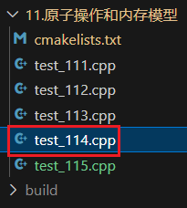
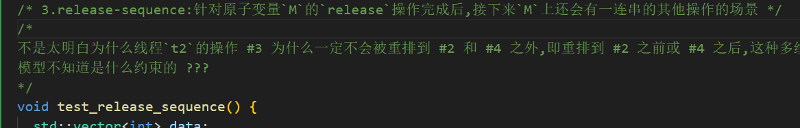
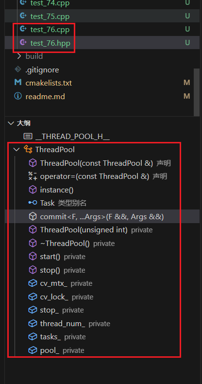

# *v24.03.26*
1. 11章结束

2. `test_115.cpp`: 关于用内存模型改进单例,没看完,以后用到再说
   [通过内存顺序实现内存模型 · 恋恋风辰的编程笔记 (llfc.club)](https://gitbookcpp.llfc.club/sections/cpp/concurrent/concpp12.html)

3. `test_114.cpp`: 第3点的`release-sequence`不是太清晰, 后面再说

   

   

4. 12章学了一部分, 更新到`test_121.cpp`, 后来去弄`TensorRT`部署`EfficientAD`模型了, 所以搁置了一段时间, 也没有 *github* 同步.
   所以今天 (五一假期前夕) *24.04.27-0055* 抽空整理了之前在笔记本上最后的学习进度, 将没上传的内容更新到 *github*, 方便后续用台式机继续学习.

   后面要不要继续拾起这个多线程开发的课程全看心情随缘了.

# *v24.03.25-2241*
1. `test_112.cpp`: 宽松内存模型 (*Relaxed ordering*)

2. `test_113.cpp`: 全局顺序一致模型 (*Sequencial consistent ordering*)

3. `test_114.cpp`: 获取发行模型 (*Acquire-release ordering*)

4. 看到了: [C++ 并发编程(12) 利用内存顺序实现内存模型_哔哩哔哩_bilibili](https://www.bilibili.com/video/BV1Cc411Z7cn/?spm_id_from=333.788&vd_source=a8a38358873e306ffdd6017aaab418e3) 0:40:47

# *v24.03.22-1047*
1. 回家同步一次.

2. 看到了:

   [C++ 并发编程(11) 原子操作和内存模型_哔哩哔哩_bilibili](https://www.bilibili.com/video/BV1m84y1d7rS/?spm_id_from=333.788&vd_source=a8a38358873e306ffdd6017aaab418e3) 1:33:08

# *v24.03.19-1703*
1. 看到了: https://www.bilibili.com/video/BV158411y7Bn/?spm_id_from=333.788&vd_source=a8a38358873e306ffdd6017aaab418e3 1:04:12
2. CSP设计模式感觉不太会调试;


# *v24.03.18-2111*
1. 正好看完了: [并发三剑客async,promise和future](https://www.bilibili.com/video/BV18w411i74T/?spm_id_from=333.788&vd_source=a8a38358873e306ffdd6017aaab418e3)

2. `test_76`是 **线程池** 的demo, 特别重要, 值得多次调试研究;

   

# *v24.03.14-2123*

1. 看到了:

   [并发三剑客async,promise和future](https://www.bilibili.com/video/BV18w411i74T/?spm_id_from=333.788&vd_source=a8a38358873e306ffdd6017aaab418e3) 35:03

# *v24.03.13-2234*

1. 看到了:

   [C++ 并发编程(6) 利用条件变量实现线程安全队列_哔哩哔哩_bilibili](https://www.bilibili.com/video/BV1934y1N7Nb/?spm_id_from=333.788&vd_source=a8a38358873e306ffdd6017aaab418e3) 
   对应`test_61.cpp`; 13:09

2. 文件结构改了下, 跟视频课对应;

# *v24.03.12-2238*

1. 看到了:
   [C++ 并发编程(4) unique_lock,共享锁以及递归锁_哔哩哔哩_bilibili](https://www.bilibili.com/video/BV1wz4y1T7fN/?spm_id_from=333.788&vd_source=a8a38358873e306ffdd6017aaab418e3) 37:08
   对应`test_36.cpp`;

# *v24.03.12-0905*
1. `test_34.cpp`是比较重要的知识点;
2. `test_34.cpp`最后`4.层级锁`太抽象没看完, 以后用到再回顾;

# *v24.03.11-2247*

1. 看到了C++17的`std::scoped_lock`

   [C++ 并发编程(3) 互斥和死锁_哔哩哔哩_bilibili](https://www.bilibili.com/video/BV1AN4y1o78q/?spm_id_from=333.788&vd_source=a8a38358873e306ffdd6017aaab418e3) 1:43:20

# *v24.03.10-2242*

1. 看到:

   [C++ 并发编程(3) 互斥和死锁_哔哩哔哩_bilibili](https://www.bilibili.com/video/BV1AN4y1o78q/?spm_id_from=333.788&vd_source=a8a38358873e306ffdd6017aaab418e3) 1:10:31

# *v24.03.08-2246*

1. 看到了:

   [C++ 并发编程(3) 互斥和死锁_哔哩哔哩_bilibili](https://www.bilibili.com/video/BV1AN4y1o78q/?spm_id_from=333.788&vd_source=a8a38358873e306ffdd6017aaab418e3) 0:26:00

# *v24.03.08-1643*

1. 看完了第二节,开始第三节.

# *v24.03.07-2236*
1. 看到了 *joining_thread*

   [C++ 并发编程(2) 线程所属权管理_哔哩哔哩_bilibili](https://www.bilibili.com/video/BV1v8411R7hD/?spm_id_from=333.788&vd_source=a8a38358873e306ffdd6017aaab418e3) 0:24:09

# *v24.03.07-1937*
1. 将`main.cpp`中的知识点拆分出来了.
2. 第一节看完.
3. `test_4`, `test_6`, `test_7` 都有看不懂的; ???

# *v24.03.06-2237*
1. 不使用`join`而使用智能指针来防止函数`oops_sp`内的局部变量`someLocalState`被释放,但是好像没有效果,不知道该怎么改.

   ```cpp
   struct func_sp {  // smart pointer
     std::shared_ptr<int> _sp;
     func_sp(std::shared_ptr<int> sp) : _sp(sp) {}
     void operator()() {
       for (int i = 0; i < 3; i++) {
         *_sp = i;
         std::cout << "--- _sp is " << *_sp << std::endl;
         std::this_thread::sleep_for(std::chrono::seconds(1));
       }
     }
   };
   
   void oops_sp() {
     auto someLocalState = std::make_shared<int>(0);
     func_sp myfunc(someLocalState);
     std::thread functhread(myfunc);
     functhread.detach();
   }
   
   oops_sp();
   ```

2. 看到了 *慎用隐式转换*

​	[C++ 并发编程(1) 线程基础，为什么线程参数默认传参方式是值拷贝？_哔哩哔哩_bilibili](https://www.bilibili.com/video/BV1FP411x73X/?spm_id_from=333.999.0.0&vd_source=a8a38358873e306ffdd6017aaab418e3) 0:42:54


# *v24.03.05-2238*
看到了 *detach的隐患*

[C++ 并发编程(1) 线程基础，为什么线程参数默认传参方式是值拷贝？_哔哩哔哩_bilibili](https://www.bilibili.com/video/BV1FP411x73X/?spm_id_from=333.788&vd_source=a8a38358873e306ffdd6017aaab418e3) 0:25:08
